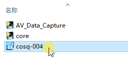
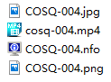
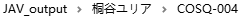
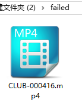
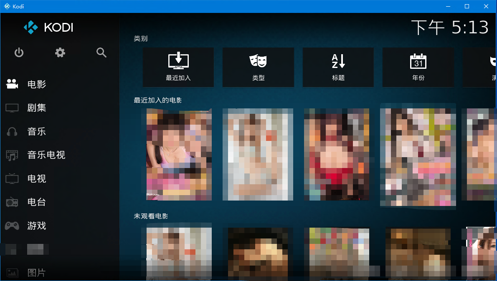

# 日本AV元数据抓取工具  

## 关于本软件

目前，我下的AV越来越多，也意味着AV要集中地管理，形成媒体库。现在有两款主流的AV元数据获取器，"EverAver"和"Javhelper"。前者的优点是元数据获取比较全，缺点是不能批量处理；后者优点是可以批量处理，但是元数据不够全。

为此，综合上述软件特点，我写出了本软件，为了方便的管理本地AV，和更好的手冲体验。没女朋友怎么办ʅ(‾◡◝)ʃ 
## 软件流程图   (下下一个为使用教程)


## 如何使用
**(release的程序可脱离python环境运行，可跳过第一步)**
1. 请安装requests,pyquery,lxml,Beautifulsoup4,pillow模块,可在CMD逐条输入以下命令安装
```python
pip install requests
```
###
```python
pip install pyquery
   ```
###
```python
pip install lxml
```
###
```python
pip install Beautifulsoup4
```
###
```python
pip install pillow
```

2. 你的AV在被软件管理前最好命名为番号:
```
COSQ-004.mp4
```
文件名中间要有减号"-"，没有多余的内容只有番号为最佳，可以让软件更好获取元数据
对于多影片重命名，可以用ReNamer来批量重命名
软件官网:http://www.den4b.com/products/renamer


3. 把软件拷贝到AV的所在目录下，运行程序（中国大陆用户必须挂VPN，Shsadowsocks开全局代理）
4. 运行AV_Data_capture.py
5. **你也可以把单个影片拖动到core程序**



6. 软件会自动把元数据获取成功的电影移动到JAV_output文件夹中，根据女优分类，失败的电影移动到failed文件夹中。







